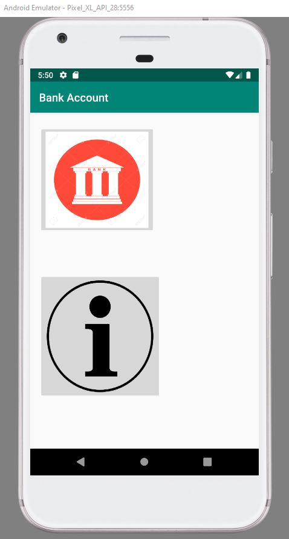
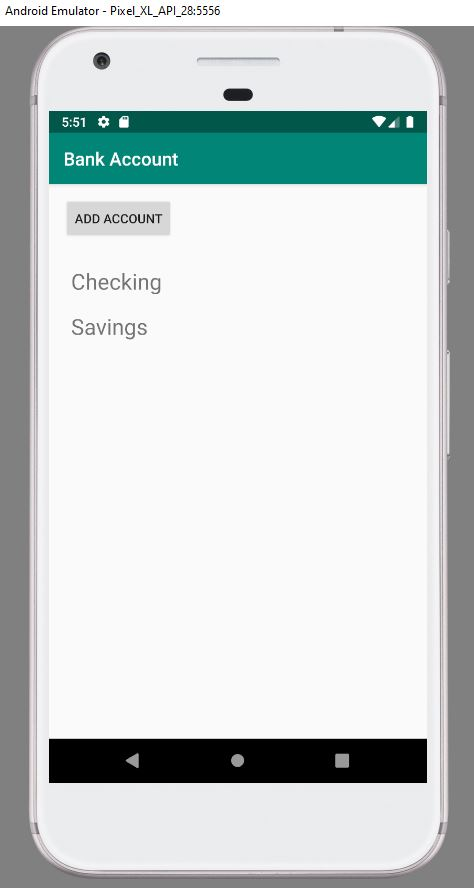
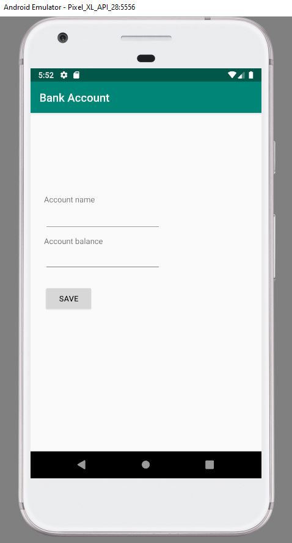
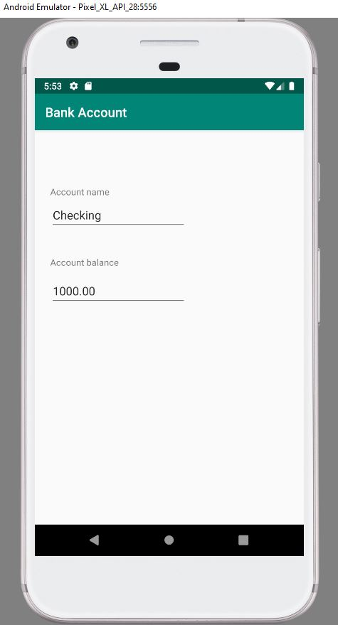
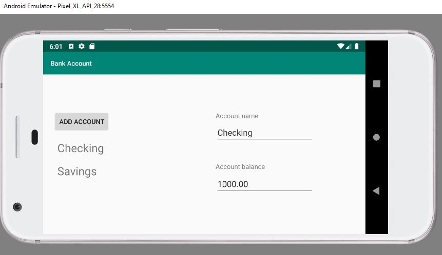
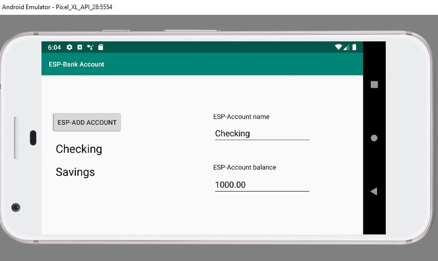

# Bank-Account

## About

The main activity uses fragments to display two images as buttons. The first button opens the AccountListActivity. The second
button opens the AppInfoActivity.

The main activity will display data depending on the orientation of the device. It uses
fragments to display all data.

If the user selects an account in portrait mode it should start AccountDetailActivity.
AccountDetailActivity will be automatically populated with data from the selected account.

If the user selects an account in landscape mode it will load data from the selected account in the
AccountDetailFragment

The AddAccountActivity lets the user add a new account. It should use fragments to
display all data.

The AccountDetailActivity shows data for an account. It should show the account name
and balance. It should contain an AccountDetailFragment that displays the data.

The application can hanle english and spanish
